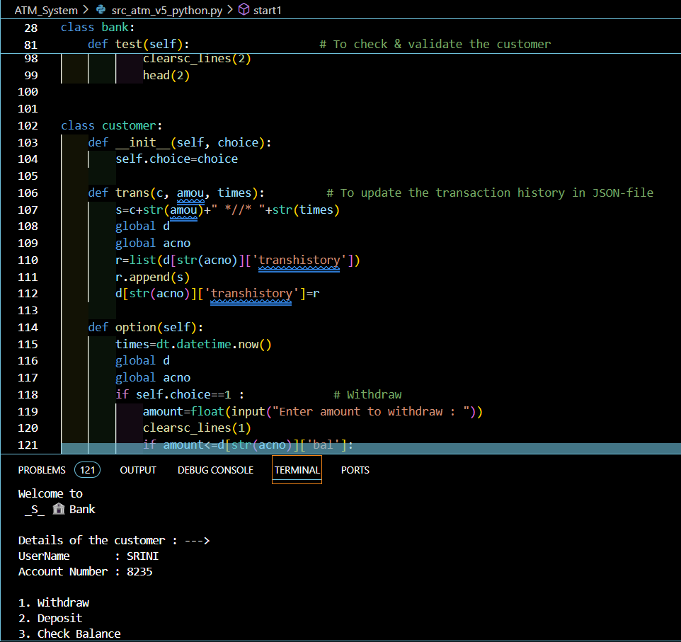

<!--  -->

# ATM System - A Robust Banking Experience

Welcome to the Project ***ATM System***! This Python application simulates an ATM interface, allowing users to perform essential banking operations such as balance inquiries, withdrawals, deposits, and account management—all within a command-line environment.

## Screenshots

## Features

**User Authentication:** Secure login using user credentials.    
**Balance Inquiry:** Check account balance with ease.       
**Withdrawals & Deposits:** Perform cash transactions with real-time balance updates.                  
**Transaction History:** View a detailed log of all transactions.       
**JSON Data Storage:** User data and transaction records are stored in JSON files for easy access and modification.
## Technologies Used

**Python:** The main programming language for building the ATM logic.          
**JSON:** Lightweight data format used for storing user information and transaction history.           
## Getting Started

**To Run the application:**  Follow the steps provided in the file named ***details.txt*** OR Follow the below steps to run the application here (in cloud),,

        1. Open the CODE-section and Start a 'CodeSpace'.
        2. In the Terminal(in CodeSpace) run 'python start.py' to start/run the application.
## Usage

The ATM application is user-friendly, with a simple menu-driven interface. Choose an operation, enter the necessary information, and the program will guide you through each step.
## Contributing

Feel free to contribute to this project by submitting issues, feature requests, or pull requests. Your input is greatly appreciated!
## Authors

- [@Srinivas-Batthula](https://www.github.com/srinivas-batthula)

# Hi, I'm Srinivas Batthula! 👋

## 🚀 About Me
I'm a Student at SNIST and proficient in Python, Responsive Web Design, Frontend development & Aspiring Full-Stack(MERN) Developer...

## 🔗 Links

## 🛠 Skills
***Javascript, HTML, CSS, Bootstrap, TailwindCSS, React, C, Python...***

